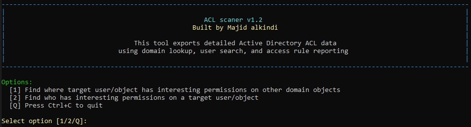

# Active Directory ACL Scaner

This C# console application connects to Active Directory and provides two-way analysis of interesting ACL permissions.

It supports:

- Finding where a target user/object has interesting privileges on other domain objects.
- Finding who has interesting privileges on a specific target user/object.


# Banner Image



## Features

- Branded startup banner with colored text.
- Runtime menu loop:
	- Option `1`: target principal -> other domain objects
	- Option `2`: target object <- principals with interesting rights
	- Option `Q`: quit
- Colored user experience:
	- Prompts in yellow
	- Success in green
	- Warnings in dark yellow
	- Errors in red
	- Verbose messages in dark gray
- Verbose domain operation logs:
	- Connecting to LDAP domain
	- Object resolution status
	- ACL read status
	- Output file write location
	- Export completion status
- Live ACL write progress in console (`processed/total (%)`).
- Safe LDAP filter handling by escaping special characters.
- Interesting permission set:
	- GenericAll
	- GenericWrite
	- WriteOwner
	- WriteDACL
	- AllExtendedRights
	- ForceChangePassword
	- Self (Self-Membership)
- Timestamped output files for both analysis options.

## Prerequisites

- .NET Framework 4.7.2
- Access and permissions to query the target Active Directory domain

## Build

Use Visual Studio (recommended), MSBuild, or dotnet build.

MSBuild:

```powershell
msbuild Domain_ACL.csproj /p:Configuration=Release /p:Platform=x64
```

dotnet build:

```powershell
dotnet build Domain_ACL.csproj -c Release -p:Platform=x64
```

## Run

```powershell
Domain_ACL.exe
```

## Runtime Flow

1. Start application.
2. Banner and options are displayed.
3. Choose an option:
	- `1`: find where the target principal has interesting rights.
	- `2`: find who has interesting rights on the target object.
	- `Q`: quit.
4. Enter:
	- Domain name (example: `yourdomain.com`)
	- Target user/object name
5. Tool connects to LDAP, resolves the target, reads ACL data, and writes report.
6. Progress and verbose status are shown in console.
7. Result path is displayed when export completes.
8. Choose `Q` anytime from the menu loop to exit.

Example inputs:

```text
Enter the domain name (e.g., yourdomain.com): yourdomain.com
Enter target user/object (source principal): UserX
```

## Output

Option `1` output format:

```text
UserX_interesting_permissions_as_source_YYYYMMDD_HHMMSS.txt
```

Option `2` output format:

```text
TargetObject_interesting_permissions_on_target_YYYYMMDD_HHMMSS.txt
```

Example option `1` output:

```text
INTERESTING PERMISSIONS REPORT (SOURCE PRINCIPAL)
============================================================================================
Input Principal   : UserX
Resolved Principal: UserX
Principal DN      : CN=UserX,OU=Users,DC=yourdomain,DC=com
LDAP Path         : LDAP://DC=yourdomain,DC=com
Objects Retrieved : 1200
Interesting Set   : GenericAll, GenericWrite, WriteOwner, WriteDACL, AllExtendedRights,
                    ForceChangePassword, Self (Self-Membership)
--------------------------------------------------------------------------------------------

[Interesting Rule 1]
  Source Principal      : YOURDOMAIN\UserX
  Target Object Name    : SQL-Admins
  Target Object DN      : CN=SQL-Admins,OU=Groups,DC=yourdomain,DC=com
  Access Type           : Allow
  Matched Permissions   : GenericWrite, WriteDACL
  AD Rights             : GenericWrite, WriteDacl
  Object Type           : N/A
  Inherited Object Type : N/A
--------------------------------------------------------------------------------------------

============================================================================================
Objects processed : 1200
Objects skipped   : 35
Interesting rules : 1
```

Example option `2` output:

```text
INTERESTING PERMISSIONS REPORT (TARGET OBJECT)
============================================================================================
Input Object      : SQL-Admins
Resolved Object   : SQL-Admins
Target DN         : CN=SQL-Admins,OU=Groups,DC=yourdomain,DC=com
LDAP Path         : LDAP://DC=yourdomain,DC=com
Rules Retrieved   : 42
Interesting Set   : GenericAll, GenericWrite, WriteOwner, WriteDACL, AllExtendedRights,
                    ForceChangePassword, Self (Self-Membership)
--------------------------------------------------------------------------------------------

[Interesting Rule 1]
  Target Object Name    : SQL-Admins
  Target Object DN      : CN=SQL-Admins,OU=Groups,DC=yourdomain,DC=com
  Source Principal      : YOURDOMAIN\HelpDesk
  Access Type           : Allow
  Matched Permissions   : GenericWrite, WriteDACL
  AD Rights             : GenericWrite, WriteDacl
  Object Type           : N/A
  Inherited Object Type : N/A
--------------------------------------------------------------------------------------------

============================================================================================
Interesting permissions summary: 1 matching rule(s) found.
```
## Disclaimer

This project is provided as-is for authorized security testing and authorized security assessments only.

Unauthorized access to computer systems is illegal.

Misuse of this tool may violate:

- Computer misuse and unauthorized access laws
- Internal security policies and acceptable use policies
- Contractual, regulatory, or compliance requirements

Use this tool only on systems and directories you own or are explicitly permitted to assess.

